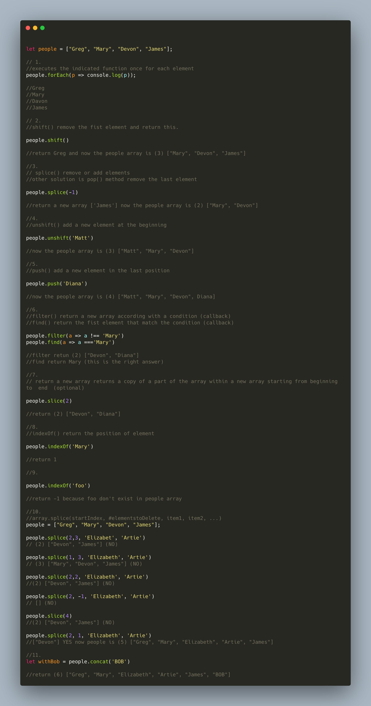

### Array Exercise

Created By [Rithm School](https://www.rithmschool.com/courses/javascript/javascript-arrays-exercise)

For each of the exercises below, assume you are starting with the following people array.

let people = ["Greg", "Mary", "Devon", "James"];

1. Using a loop, iterate through this array and console.log all of the people.
2. Write the command to remove "Greg" from the array.
3. Write the command to remove "James" from the array.
4. Write the command to add "Matt" to the front of the array.
5. Write the command to add your name to the end of the array.
6. Using a loop, iterate through this array and after console.log-ing "Mary", exit from the loop.
7. Write the command to make a copy of the array using slice. The copy should NOT include "Mary" or "Matt".
8. Write the command that gives the indexOf where "Mary" is located.
9. Write the command that gives the indexOf where "Foo" is located (this should return -1).
10. Redefine the people variable with the value you started with. Using the splice command, remove "Devon" from the array and add "Elizabeth" and "Artie". Your array should look like this when you are done ["Greg", "Mary", "Elizabeth", "Artie", "James"].
11. Create a new variable called withBob and set it equal to the people array concatenated with the string of "Bob".

